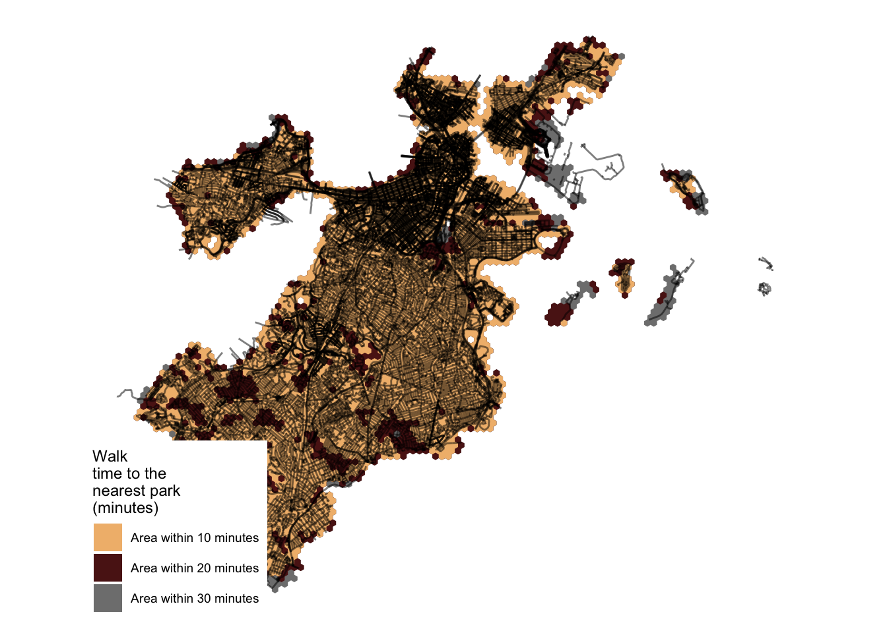
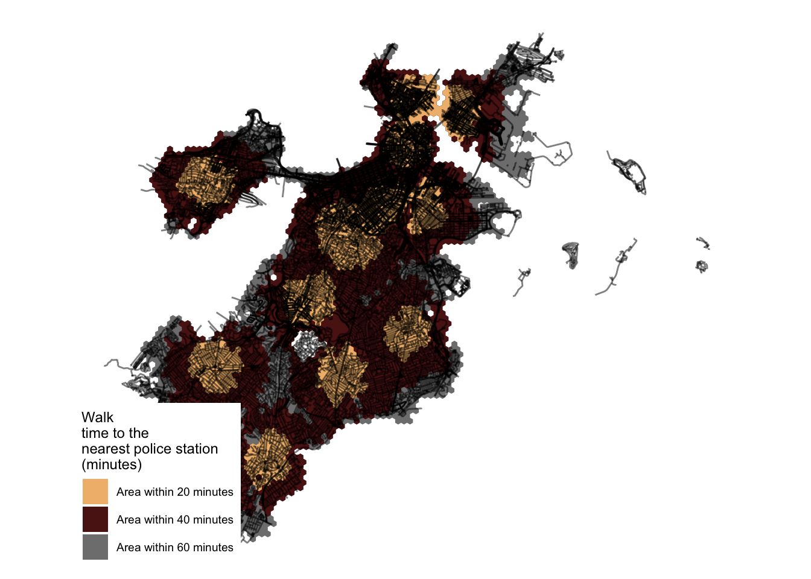
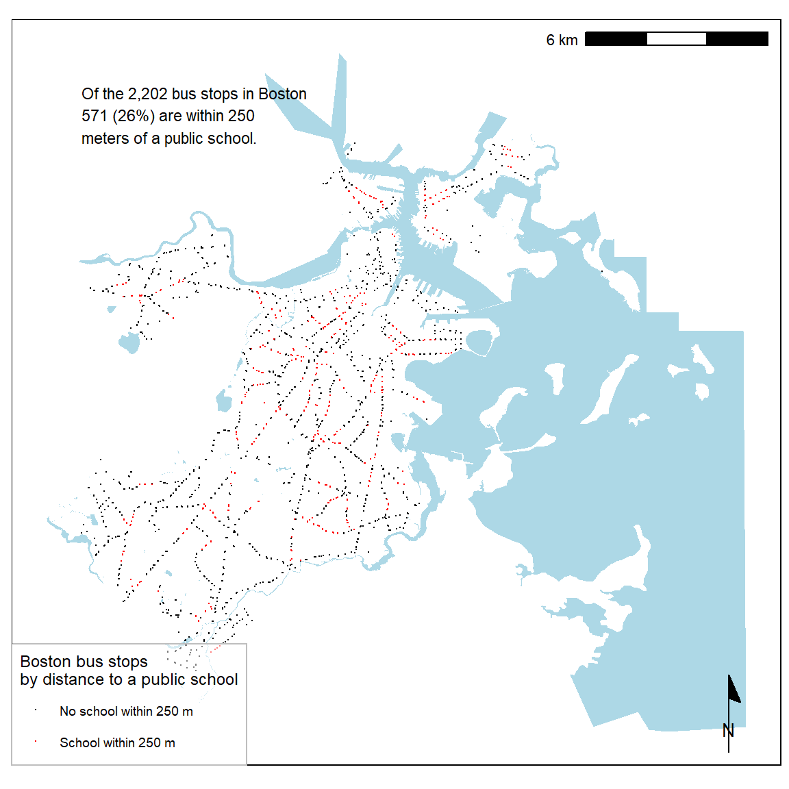
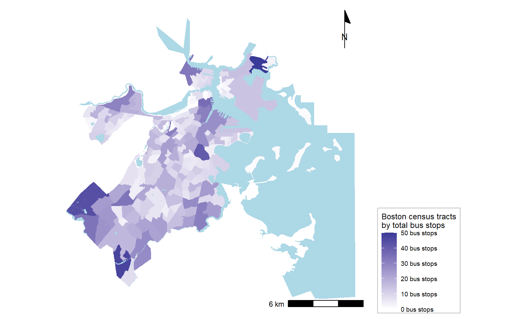
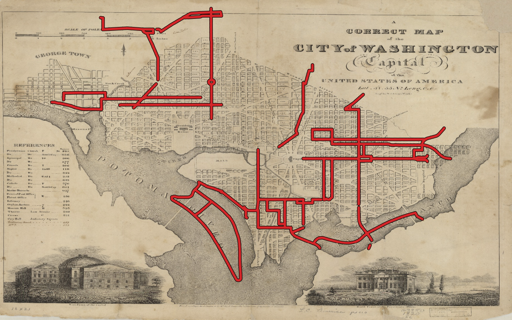
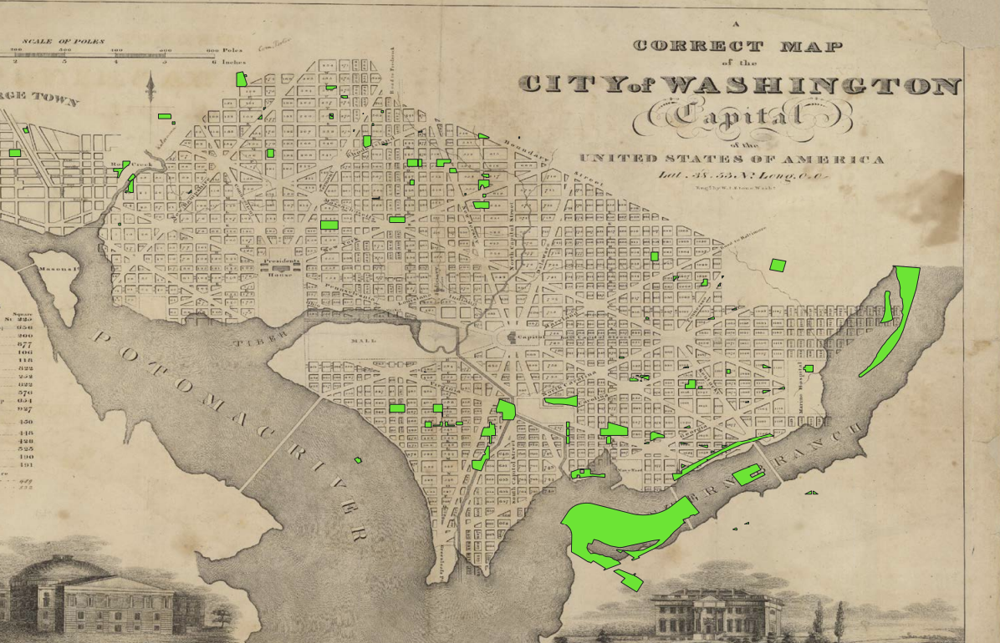
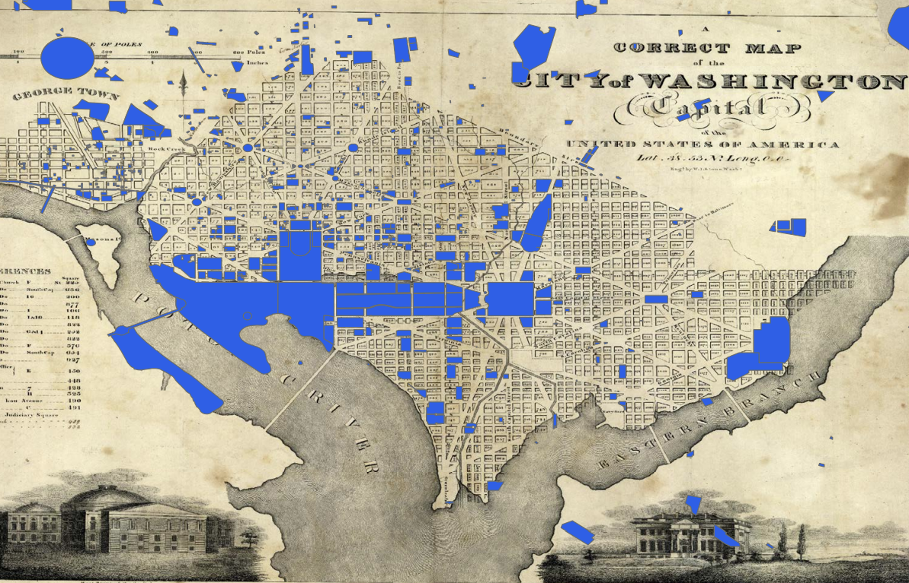
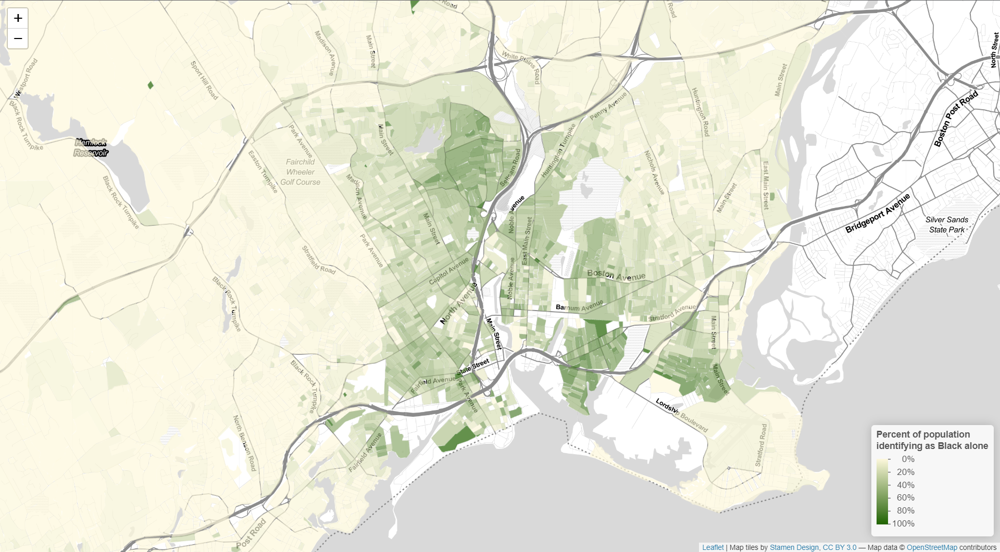

```{r setup, include=FALSE}
knitr::opts_chunk$set(echo = TRUE)
```


This portfolio the following skills that I have developed in VIS 2128 Spatial Analysis module:

* Displaying multiple vector layers on the same map
* Calculating and displaying relationships among point and polygon layers based on distance
* Aggregating point data to a layer of polygons
* Calculating and displaying accessibility, based on travel time
* Converting between raster layers and vector layers
* Displaying raster data on a map
* Georeferencing a raster image
* Displaying data on an interactive map

# Maps of Boston
The following two Boston maps explore walking times to the nearest parks and to the nearest police stations. These maps display the use of multiple vector layers on the same map as well as the ability to calculate and displaying accessibility, based on travel time.

## Walk Time to Nearest Parks

[](https://tayntot.github.io/portfolio/thumbnails/Walk time to the nearest park.png){target="_blank"}

## Walk Time to Nearest Police Stations

[](https://tayntot.github.io/portfolio/thumbnails/walk time to the nearest police station.png){target="_blank"}


## Distance Between Bus Stops and Public Schools
This plot shows MBTA bus stops within 250 m of a Boston public school (in red) and those outside of a 250 m buffer from a public school. The color scheme is fairly divergent, making the contrast between these two groups of bus stops clear. The following map displays the ability to calculate and display relationships among point and polygon layers based on distance.


[](https://tayntot.github.io/portfolio/thumbnails/Boston bus stops by distance to a public school.png"}

## Number of Bus stops within each Boston Census Tract 
Rather than Boston neighborhoods, this map displays the total number of MBTA bus stops in each of Boston’s 180 census tracts. We increased the color gradient to have additional breaks. We also see that Dorchester has an uneven distribution of bus stops in its census tracts, despite overall having the greatest number of bus stops. The following map displays the ability to aggregate point data to a layer of polygons


[](https://tayntot.github.io/portfolio/thumbnails/boston census tracts by total bus stops.png){target="_blank"}

# Georeferencing Washington D.C.
The following maps display the use of georeferencing a raster image as well as displaying data on an interactive map.As a group we were curious about analyzing how natural resources could be affected by evolution of the built environment. Francisco suggested Washington, D.C., as he knew of a creek that once flowed through the middle of the region, had since been diverted as the city was built. As part of the built environment, we wanted to see how public spaces and places of significance were included in this development. We selected parks, bike paths, and historic landmarks to show what the city once was and how it is utilized today.

[](https://tayntot.github.io/portfolio/thumbnails/Georeference 1.png){target="_blank"}

[](https://tayntot.github.io/portfolio/thumbnails/georeference 2.png){target="_blank"}

[](https://tayntot.github.io/portfolio/thumbnails/georefernce 3.png){target="_blank"}


# Interactive Mapping
The following maps use census data show the percentage of Black population in Fairfield County in Connecticut and Union County in New Jersey.

[](https://tayntot.github.io/portfolio/fullsize/inter_black.html){target="_blank"}